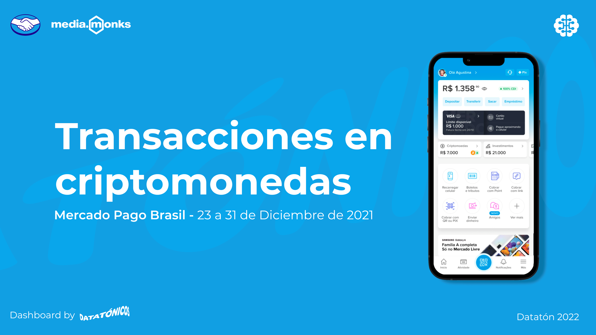
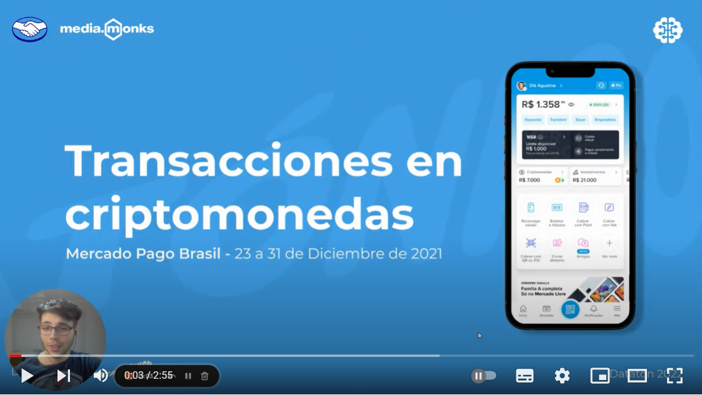
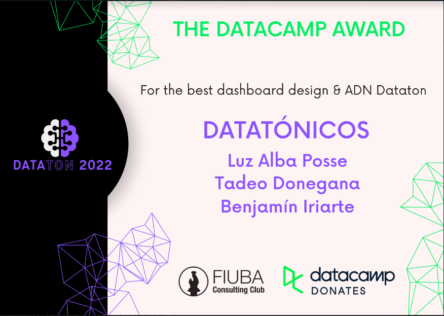

This repository contains the work we did for the **FIUBA Dataton 2022** powered by *Mercado Libre, Media.Monks, ZS | Medullan, Cirque du Soleil Entertainment Group and DataCamp*.

Our work was to analyze data from some **Mercado Pago Brazil** datasets containing transactions with cryptocurrency from the 23rd to the 31st of December 2021.

After **cleaning the datasets** and doing an **exploratory data analysis**, we presented a **Tableau Dashboard** with the conclusions we got. You can see the dashboard online [here](https://public.tableau.com/views/Dashboard-DesafioMedia_Monks-MercadoLibre-37-Datatonicos/TransactionsDashboard?:language=es-ES&:display_count=n&:origin=viz_share_link).

This was our pitch video for the judges *(click on the image below to watch it on YouTube)*:

With this work we won **The Datacamp Award**, for the best dashboard design & ADN Dataton.

The **Datatonicos** team is made up of:

- Luz Alba Posse

- Benjamin Iriarte Crom

- Tadeo Donegana Braunschweig
